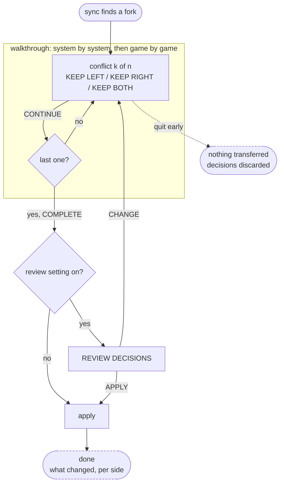

# Conflict wizard — IA and flow

Low-fidelity structure for the cloud-save conflict wizard (#23). **Information
architecture and interaction only** — what is on screen, what the player can do,
and where each choice leads. No visual design: no sizes, colours, spacing or
component choices. Those come later, against
[es-ui-style-guide.md](es-ui-style-guide.md).

Companion to [es-menu-map.md](es-menu-map.md), which places this subtree in the
wider menu. Rendered low-fidelity wireframes of these screens, with the reasoning
in the margins: <https://claude.ai/code/artifact/5da9ce12-b088-4db0-8557-4b34fe454dd6>

> **Rev 2.** No entry screen, no summary step, no deferring. The count moved
> into the conflict header, the summary became an opt-in setting, and
> "keep discarded saves" replaced deferral as the way out of a decision you
> are unsure about.

## Scope: what counts as a conflict

Only a genuine fork needs a decision. Everything else is applied without asking:

| Situation | Handling |
|---|---|
| Exists in cloud only | download, no prompt |
| Exists on device only | upload, no prompt |
| Same on both sides | nothing |
| **Changed on both sides since they last agreed** | **conflict — ask** |

The header counts *genuine conflicts*, not files that differ, or it will look
alarming when nothing is at risk.

## Flow



Properties the flow has to keep:

- **Nothing transfers until COMPLETE.** The walkthrough is reversible right up
  to the end; quitting partway leaves both sides exactly as they were.
- **Every conflict gets a decision.** There is no defer, because a discarded
  copy is recoverable when *keep discarded saves* is on — that setting, not
  deferral, is the escape hatch for "I am not sure".

## Screens

Abstracted. Boxes are regions, not components. Same layout for every conflict —
only the picture and the available options change.

```
┌──────────────────────────────────────────────┐
│ 3 CONFLICTS FOUND                            │   count, not a separate screen
│ <game name> · <system> · <kind>              │
├───────────────────────┬──────────────────────┤
│ CLOUD                 │ THIS DEVICE          │   fixed order, every time
│ ┌───────────────────┐ │ ┌──────────────────┐ │
│ │[☁]   screenshot   │ │ │[🎮]  screenshot  │ │   source badge overlaid
│ │      or glyph     │ │ │      or glyph    │ │
│ └───────────────────┘ │ └──────────────────┘ │
│ <date> <time>         │ <date> <time>        │
│ <device + model>      │ <device + model>     │
│ <emulator/core + ver> │ <emulator/core + ver>│
├───────────────────────┴──────────────────────┤
│  ( KEEP LEFT )  ( KEEP RIGHT )  ( KEEP BOTH )│   selected side(s) highlight
│  [ CONTINUE ]        …or [ COMPLETE ] if last│
│  merged saves move to the lowest unused slot │   only when KEEP BOTH is picked
└──────────────────────────────────────────────┘
```

Selecting a side **highlights that column**, so LEFT/RIGHT never has to be
mapped mentally onto CLOUD/DEVICE. Keep the sides in a **fixed order** across
every conflict — muscle memory does the work on a long list, and a column that
swaps sides is how the wrong save gets picked at speed.

## What each kind shows

| | Savestate | In-game save |
|---|---|---|
| Picture | screenshot, source badge overlaid | glyph, source badge overlaid |
| Metadata | date · time · device + model · **core + version** | date · time · device + model · emulator + version |
| Emulator info means | **compatibility** — core- and chipset-specific, may not load (#19) | context — usually portable across emulators |
| KEEP BOTH | yes — moves to the lowest unused slot | **no** — fixed slots; shown disabled with a reason |
| Losing copy | retained only when *keep discarded saves* is on | same |

KEEP BOTH is **dimmed, not hidden**, on in-game saves — the house rule from
[es-ui-style-guide.md](es-ui-style-guide.md), and a dimmed control with a reason
teaches what a vanished one cannot.

## Settings

Two toggles, both in the cloud-saves area:

- **Review decisions before applying** — off by default; turns the summary from
  a step everyone pays for into one the careful can opt into.
- **Keep discarded saves** — retains the losing copy so a choice can be undone.
  This is the same machinery as #25 (pre-change snapshots and rollback); build
  it once.

## Semantics

The icon says *where*, the badge says *what is happening to it*:

| Meaning | Glyph |
|---|---|
| cloud side | cloud |
| this device | gamepad |
| in-game save | floppy |
| savestate | picture |
| will download / upload | cloud-download / cloud-upload (pre-composed) |
| may not load here | warning (#19) |
| resolved / discarded | check-circle / times-circle |

All present in the shipped `fontawesome-webfont.ttf` — see #23 for codepoints
and why pre-composed glyphs beat overlaying two text glyphs. The source badge
over a screenshot *is* a real overlay, but it is a badge over an image, which is
ordinary.

**Conflict is a property of the pair, not of a side.** The header owns "this is
a conflict"; the panels own "here is what each one is".

## Open questions

- **Does progress survive an interruption?** Nothing applies until COMPLETE,
  which is safe — but on a long list, quitting near the end throws away every
  decision made.
- **"Lowest unused slot" — unused where?** A slot free locally but taken in the
  cloud will collide at the next sync, turning one resolved conflict into a new
  one. The renumbered state's screenshot has to move with it, or the picker
  shows the wrong picture next time.
- **What happens when slots are full?** KEEP BOTH should be refused up front
  with a reason rather than failing at apply.
- **Does *keep discarded saves* default on or off?** Off makes the default path
  destructive; on needs a retention rule, on a device whose storage is a card.
- **Which side is left?** Fix it once — cloud or device — and never vary it.
