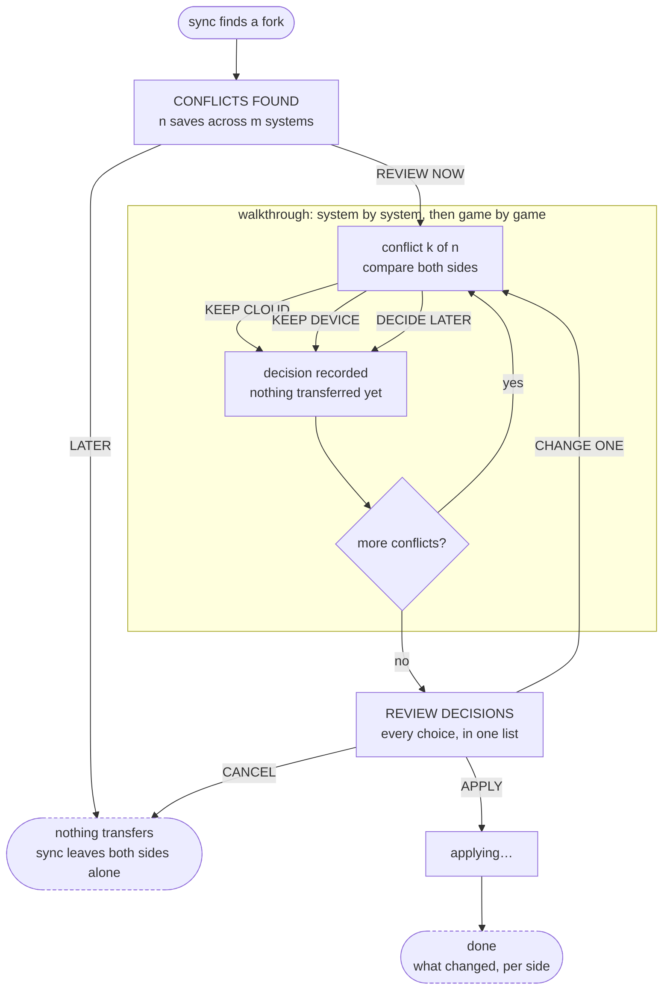

# Conflict wizard — IA and flow

Low-fidelity structure for the cloud-save conflict wizard (#23). **Information
architecture and interaction only** — what is on screen, what the player can do,
and where each choice leads. No visual design: no sizes, colours, spacing or
component choices. Those come later, against
[es-ui-style-guide.md](es-ui-style-guide.md).

Companion to [es-menu-map.md](es-menu-map.md), which places this subtree in the
wider menu.

## Scope: what counts as a conflict

Only a genuine fork needs a decision. Everything else is applied without asking:

| Situation | Handling |
|---|---|
| Exists in cloud only | download, no prompt |
| Exists on device only | upload, no prompt |
| Same on both sides | nothing |
| **Changed on both sides since they last agreed** | **conflict — ask** |

This matters for the flow: the wizard opens on the *count of genuine conflicts*,
not on the number of files that differ, or it will look alarming when nothing is
actually at risk.

## Flow



Two properties the flow has to keep:

- **Nothing transfers until APPLY.** A player can walk the whole list, change
  their mind, or leave — and the device and cloud are still as they were.
- **LATER is always available and always safe.** Deferring must never be the
  option that loses something, or players will feel pressured into deciding
  quickly, which is how the wrong save gets picked.

## Screens

Abstracted. Boxes are regions, not components.

### 1. Entry

```
┌──────────────────────────────────────────────┐
│ CLOUD SAVES NEED YOUR ATTENTION              │
│                                              │
│  n saves changed in both places since they   │
│  last matched. Choose which to keep.         │
│                                              │
│  Nothing is uploaded or downloaded until     │
│  you confirm.                                │
│                                              │
│  affected: <system>, <system>, <system>      │
│                                              │
│         [ REVIEW NOW ]      [ LATER ]        │
└──────────────────────────────────────────────┘
```

### 2. Compare — savestate

The screenshot does the work; the glyph is a small kind marker.

```
┌──────────────────────────────────────────────┐
│ <SYSTEM>  ·  conflict k of n                 │
│ ┌────────┐ <game name>                       │
│ │box art │ savestate, slot 3                 │
│ └────────┘ (box art optional, header only)   │
├───────────────────────┬──────────────────────┤
│ CLOUD            [c]  │ THIS DEVICE     [d]  │
│ ┌───────────────────┐ │ ┌──────────────────┐ │
│ │                   │ │ │                  │ │
│ │    screenshot     │ │ │    screenshot    │ │
│ │                   │ │ │                  │ │
│ └───────────────────┘ │ └──────────────────┘ │
│ <date> <time>         │ <date> <time>        │
│ from <device name>    │ from this device     │
│ <emulator> <version>  │ <emulator> <version> │
│ [!] may not load here │                      │
├───────────────────────┴──────────────────────┤
│  [ KEEP CLOUD ]  [ KEEP DEVICE ]  [ LATER ]  │
└──────────────────────────────────────────────┘
```

### 3. Compare — battery save

No screenshot exists, so the panel is glyph-led. Same layout, no empty frame.

```
├───────────────────────┬──────────────────────┤
│ CLOUD            [c]  │ THIS DEVICE     [d]  │
│                       │                      │
│        [save]         │        [save]        │
│                       │                      │
│ <date> <time>         │ <date> <time>        │
│ from <device name>    │ from this device     │
│ <size>                │ <size>               │
├───────────────────────┴──────────────────────┤
```

### 4. Review decisions

```
┌──────────────────────────────────────────────┐
│ REVIEW DECISIONS                             │
│                                              │
│  <system> · <game> slot 3     keep cloud  ↓  │
│  <system> · <game>            keep device ↑  │
│  <system> · <game>            later       —  │
│                                              │
│  x will download, y will upload, z untouched │
│                                              │
│     [ APPLY ]   [ CHANGE ]   [ CANCEL ]      │
└──────────────────────────────────────────────┘
```

Applying is the first destructive moment, so it confirms per
[es-ui-style-guide.md](es-ui-style-guide.md) — and the confirmation states the
count, not just "are you sure".

### 5. Applying, and done

Progress while transferring; on completion, what actually changed on each side,
including anything skipped and why. A failure part-way leaves the rest
untouched and says which items were and were not applied.

## Semantics

Source and state, kept separate — the icon says *where*, the badge says *what
is happening to it*:

| Meaning | Glyph | Notes |
|---|---|---|
| cloud side | cloud | |
| this device | gamepad | |
| battery save | floppy | kind marker |
| savestate | picture | kind marker |
| will download | cloud-download | pre-composed, no overlay needed |
| will upload | cloud-upload | pre-composed, no overlay needed |
| may not load here | warning | compatibility, from #19 |
| resolved | check-circle | |
| discarded side | times-circle | applied to the *losing* panel |

All present in the shipped `fontawesome-webfont.ttf` — see #23 for the
codepoints and the note on why pre-composed glyphs beat overlaying.

**Conflict is a property of the pair, not of a side.** Badging both panels with
a warning says the same thing twice and implies each side is individually
suspect. The header owns "this is a conflict"; the panels own "here is what
each one is".

## Open questions

- Does the walkthrough allow jumping straight to REVIEW DECISIONS from any
  conflict, for a player who wants to bail out of a long list?
- Is DECIDE LATER per-conflict, per-system, or both?
- When a system has many conflicts, does it get its own summary before moving
  on, or does the whole run share one?
- What happens to a deferred conflict on the next sync — re-offered silently,
  or does the entry screen distinguish new conflicts from previously deferred?
