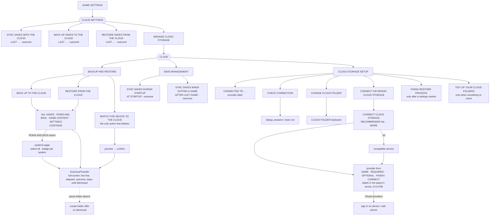
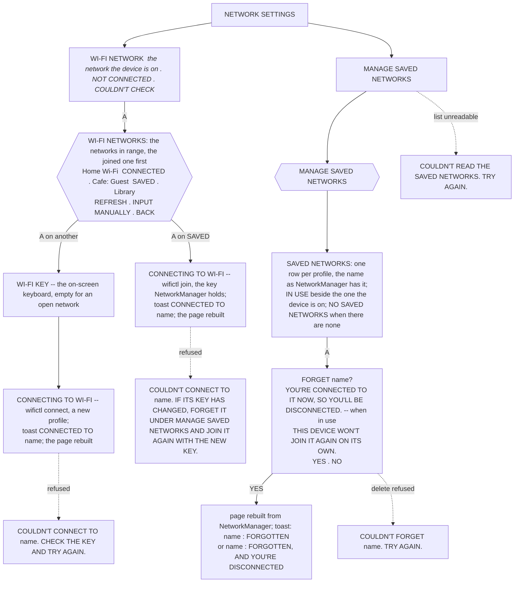

# EmulationStation menu map

Where every screen lives, so a new feature can be placed rather than invented.
Derived from `es-app/src/guis/` in `ROCKNIX/emulationstation-next` (surveyed
2026-08-19 against the `20260818` build) and verified against the running UI with
`tools/vm-visual-qa`.

Companion documents: [es-ui-style-guide.md](../.claude/rules/es-ui-style-guide.md) — how a screen
should look and behave once you know where it goes; and
[conflict-wizard-ia.md](conflict-wizard-ia.md) — the flow and screen structure
for the cloud-save conflict wizard (#23), now entering implementation — milestone "Cloud Saves: Visual Conflict Resolution".

## Two ways in

EmulationStation has **two** entry points, and they lead to different trees:

| Button | Opens | Purpose |
|---|---|---|
| **START** | MAIN MENU | Everything configurable |
| **SELECT** | QUICK ACCESS (system view) / VIEW OPTIONS (game list) | Context actions for what is on screen |

Both are built by the same code (`GuiMenu::openQuitMenu_static` serves QUIT and
QUICK ACCESS), which is why QUIT's rows appear inside QUICK ACCESS.

## Main menu


In **kid or kiosk mode the entire block above collapses** to INFORMATION,
UNLOCK USER INTERFACE MODE, RETROACHIEVEMENTS (if configured) and QUIT. Anything
you add to the full-UI block simply does not exist for those users — which is the
correct default for configuration, but check it deliberately.

## What lives where

The section headers (`addGroup`) are the real information architecture; use them
to decide where something belongs.

| Destination | Groups it contains |
|---|---|
| **GAME SETTINGS** | TOOLS · ACCOUNTS · BIOS SETTINGS · SAVE STATES · DEFAULT GLOBAL SETTINGS · **CLOUD SETTINGS** · SYSTEM SETTINGS (per-system config) |
| **CONTROLLER & BLUETOOTH** | SETTINGS · BLUETOOTH · DISPLAY OPTIONS · BEHAVIOR · PLAYER ASSIGNMENTS |
| **USER INTERFACE** | APPEARANCE · CONTROL OPTIONS · DISPLAY OPTIONS · GAMELIST OPTIONS · ICONS |
| **GAME COLLECTION** | COLLECTIONS TO DISPLAY · CREATE CUSTOM COLLECTION · OPTIONS |
| **SOUND** | VOLUME · MUSIC · SOUNDS |
| **NETWORK** | INFORMATION · SETTINGS · NETWORK SERVICES · SYNCTHING SERVICES · VPN SERVICES · FINISH RESTORE PROCESS (only after a restore) — *no cloud group; D-UI-015/017* |
| **SCRAPER** | tabbed: SCRAPE · OPTIONS · ACCOUNTS |
| **UPDATES & DOWNLOADS** | DOWNLOADS · SOFTWARE UPDATES |
| **SYSTEM SETTINGS** | SYSTEM · HARDWARE · DEVICE · STORAGE · PERFORMANCE · TWEAKS · SUSPEND · LED HARDWARE · ADVANCED |

Two placement rules the existing tree already follows:

- **Read-only facts come before editable settings.** NETWORK SETTINGS opens with
  an INFORMATION group (IP address, internet status) and only then SETTINGS.
- **Destructive and system-level operations sit behind ADVANCED**, inside SYSTEM
  SETTINGS → SYSTEM MANAGEMENT AND RESET, where every row confirms first.

## Save state manager

A game's long-press menu > SAVE STATES, or before every launch under GAME
SETTINGS > SAVE STATES > SHOW SAVE STATE MANAGER. The tiles are START NEW GAME,
START NEW AUTO SAVE (only while no auto save exists), AUTO SAVE, and one per
numbered slot -- dated and newest first under INCREMENT PER SAVE, `SLOT n` under
DO NOT INCREMENT (D-UI-059). Since #196 (D-UI-057) the image ships Batocera's
`es_savestates.cfg` entry and the launcher carries Batocera's contract, so
RetroArch does the loading and the saving itself and the interface never parks
or restores a file: **LAUNCH on a numbered slot** starts RetroArch on that slot
(`-e <n>`), which becomes its current slot, and with AUTO SAVE/LOAD on quitting
writes RetroArch's exit auto save as on any other run -- the AUTO SAVE tile
then shows the quit time and the slot's file is untouched (before, the
interface put the pre-launch auto save back and the quit state was lost);
**LAUNCH on AUTO SAVE**, like a plain launch with AUTO SAVE/LOAD on, auto-loads
that file and quitting overwrites it, as before; **START NEW GAME** runs with
the exit auto save and auto-load off for that session, so it still writes no
auto save and the existing one is kept, as upstream. INCREMENTAL SAVE STATES
offers INCREMENT PER SAVE and DO NOT INCREMENT; INCREMENT SLOT went with
Batocera's `001-no-next-slot` patch, under which the launched slot is the
current slot, never the next free one.

## Cloud (our subtree)

As built on 2026-09-12 (ES `51639dd09`; the tree since `af2db4ab09`). One door:
`GAME SETTINGS > CLOUD SETTINGS`. The three save actions sit at that level
because saves move constantly; everything occasional is one row further in,
behind MANAGE CLOUD STORAGE (D-UI-021 lineage; the vocabulary is D-UI-022 and
D-CLOUD-049/050: *saves*, *settings*, *ROMs and BIOS*, *game content*;
*back up* and *restore*, with *sync* reserved for the automatic behaviour,
D-UI-040). `NETWORK
SETTINGS` carries no cloud group. The relink row and its page are called
FINISH RESTORE PROCESS (D-UI-046). Rows are a label and at most one line
under it (D-UI-023); the line under a launching row is how it last went
(`LAST <date> - <outcome>`, D-UI-029), read uncached from
`/storage/.cache/cloud_sync/last-<name>`.



**Dialogs the cloud raises on its own.** A restore against a cloud whose saves
folder is missing ends COMPLETED and offers to create it (D-CLOUD-085); when a
folder with a near name sits beside the missing one the dialog names both and
offers CHANGE FOLDER · CREATE ANYWAY · NOT NOW (D-CLOUD-091). Both surfaces
raise it in the same words (`CloudOffer::present`, #145): the card, as it
fades, for the save rows in GAME SETTINGS; the transfer page, when the player
dismisses the done page, for RESTORE FROM THE CLOUD -- until #145 only the
card did, and the fresh handheld's route saw nothing. BACK UP / RESTORE
on a device with no cloud storage asks SET IT UP NOW? and YES opens the list.
FINISH RESTORE PROCESS (after a settings restore) tells the player the backup
never carried the cloud sign-in and points at MANAGE CLOUD STORAGE (D-CLOUD-087).

**Since RC-11 (#187, #192).** A transfer started from BACK UP TO THE CLOUD, RESTORE FROM THE CLOUD or MATCH can be left running: B closes its page and the row that launched it reads the run (`BACKING UP... - ITEM i OF n  ·  <item>`, refreshed each second) while the other two rows dim; pressing any of the three reopens the page; after the end the row reads `LAST <date> - COMPLETED` (or `COULDN'T FINISH` / `SKIPPED - ...`) until the outcome page is seen, then goes back to its one-line description. Launching a game while a transfer runs asks -- the sentence naming the transfer, then STOP IT AND PLAY or KEEP WAITING (D-CLOUD-129, since RC-12 build 4; until then it was refused). The startup card's first step reads `CHECKING THE CONNECTION...` when the interface sees a link and `WAITING FOR A NETWORK, UP TO 60 SECONDS...` when it does not; `SKIPPED - YOU'RE NOT ONLINE` follows the wait as before.

## Network (our rows)

`NETWORK SETTINGS > SETTINGS`, as built for #191 (2026-09-15), reworded for
RC-12 build 1 on the maintainer's two calls (D-UI-061, D-UI-062) and reshaped
for build 2 on their third: the phone paradigm (#201, D-UI-063, D-UI-064).
Wi-Fi is NetworkManager: it keeps a profile for every network the device has
joined and autoconnects to whichever saved one is in range, so the network the
device is on and the one the player configured last (`wifi.ssid`) are two
different facts. The row used to show -- and edit -- the setting as though it
were the connection.



- **The WI-FI NETWORK row's value is the network the device is on now**
  (D-UI-063; the label is D-UI-071, WI-FI SSID until RC-12 build 6), asked of NetworkManager (`wifictl current`) off the interface
  thread as the IP ADDRESS and INTERNET STATUS rows are: CHECKING... until
  the answer, then the name, NOT CONNECTED when the device is on none, or
  COULDN'T CHECK when NetworkManager itself did not answer -- two different
  facts, and the row does not read the second as the first. Maintainer,
  2026-09-15: the value should be the connected network, as on a phone. The
  setting `wifi.ssid` still exists and follows the player's choice (the
  picker's connect writes it; `wifictl join` moves it onto the joined
  network from the profile, key included, never printed) so the paths that
  connect from the settings -- the WI-FI KEY row, the ENABLE WI-FI switch,
  the restore wizard -- name the network the player is on. No line under the
  label: build 1's `CONNECTED TO <other>` line existed only because the
  value was the setting.
- **The picker (WI-FI NETWORKS)** lists the networks in range (`wifictl
  list`, a rescan behind the spinner), the joined one first and marked
  CONNECTED, the ones NetworkManager holds a profile for marked SAVED
  (`WifiText::pickerRows`, unit-tested); a saved network out of range is not
  a row (D-UI-064) -- this list is what can be joined from here. A on a
  saved row joins it with the key NetworkManager holds (`wifictl join`:
  `nmcli connection up`, then the settings follow, then `pin` prefers it at
  the next boot and resume); A on any other row asks for the key (the
  on-screen keyboard; START accepts, empty for an open network) and
  connects at once (`wifictl connect`, a new profile); INPUT MANUALLY takes
  a hidden network's name the same way. On success a toast CONNECTED TO
  <name> and the page is rebuilt so every row reads the connection back;
  failures are dialogs naming the network. Before this, picking a network
  the device had joined before ran `wifictl connect` with whatever key sat
  in the WI-FI KEY row, which deletes the saved profile and rebuilds it with
  that key.
- **MANAGE SAVED NETWORKS** (D-UI-062: "saved" is the maintainer's word and
  `wifictl`'s, and the page, its group and its dialogs use no other) sits
  with the Wi-Fi rows (Wi-Fi on, not LOCAL PLAY MODE). Its page lists
  `wifictl saved` -- NetworkManager's wireless profiles, the one in use
  first as nmcli orders them -- behind a spinner,
  since one nmcli call is one D-Bus round trip to a service that can stop
  answering (#102). A on a row confirms, YES first, so B answers NO; the
  help bar names A FORGET only while there is a network to forget. FORGET
  deletes the profile (`wifictl forget <name>`): the device stops joining
  that network on its own and the password NetworkManager held goes with
  it; `wifi.ssid` and `wifi.key` are untouched, so the network the player
  configured is still one press away in the picker. Forgetting the one in
  use disconnects the device at once (NetworkManager may then join another
  saved network in range), and the toast says so. A list that could
  not be read is a dialog, not an empty page: an empty list and no list are
  different answers, in the script (exit 1) as on the screen.

## RetroAchievements (our rows)

`GAME SETTINGS > RETROACHIEVEMENTS SETTINGS > OPTIONS` carries one row of the
fork's under HARDCORE MODE: OFFLINE ACHIEVEMENTS (BETA) / `Casual achievements
only.` with an arrow (D-RA-003, D-UI-053), shown only where
`/usr/bin/raofflineproxy-ctl` exists. Its page (as built for the eighth candidate,
2026-09-14, #165/#173/#179/#184/#189; D-RA-002..005, D-RA-010, D-RA-012, D-RA-013,
D-UI-054):

```mermaid
flowchart TD
    RAS[RETROACHIEVEMENTS SETTINGS] --> OA[OFFLINE ACHIEVEMENTS (BETA)<br/><i>Casual achievements only.</i>]
    OA --> PAGE{{OFFLINE ACHIEVEMENTS (BETA)}}
    PAGE --> SW[OFFLINE ACHIEVEMENTS (BETA) switch] -->|on| TURNON[dialog: beta, casual only, hardcore off;<br/>with the startup index off: IT ALSO TURNS ON INDEX NEW GAMES AT STARTUP...<br/>TURN ON . NOT NOW]
    TURNON -->|TURN ON, online| SCANNOW[SCAN GAMES FOR OFFLINE ACHIEVEMENTS NOW?<br/>the scan's sentence<br/>SCAN NOW . LATER]
    TURNON -->|TURN ON, no address| NOTONLINE[YOU'RE NOT ONLINE. SCAN GAMES FOR OFFLINE ACHIEVEMENTS WHEN YOU'RE CONNECTED...<br/>OK]
    PAGE --> I1[one block, after the two options and a half-line gap: EARN CASUAL ACHIEVEMENTS WITHOUT A CONNECTION. THEY ARE SENT WHEN YOU'RE BACK ONLINE. CASUAL ACHIEVEMENTS ONLY, SO TURNING IT ON TURNS HARDCORE MODE OFF. '!RA!' IN A GAME'S CORNER MEANS AN ACHIEVEMENT HASN'T REACHED RETROACHIEVEMENTS YET. NEW GAMES ARE ADDED THE NEXT TIME YOU'RE CONNECTED.]
    PAGE --> SCAN[SCAN GAMES FOR OFFLINE ACHIEVEMENTS<br/><i>NOT SCANNED YET . N GAMES READY FOR OFFLINE PLAY</i><br/><i>LAST date - COMPLETED or COULDN'T FINISH . N GAMES READY FOR OFFLINE PLAY</i><br/><i>WHEN YOU CAME ONLINE - outcome . N GAMES READY ...</i><br/><i>SCANNING... - GAME i OF n . N GAMES READY (a scan left running with B, PL-07)</i><br/><i>SAVING GAMES FOR OFFLINE PLAY... - GAME i OF n . N GAMES READY (a top-up the ctl runs, #189; refreshed once a second)</i>]
    SCAN -.->|switch off| DIM1[dimmed: TURN ON OFFLINE ACHIEVEMENTS FIRST.]
    SCAN -.->|no address| DIM2[dimmed: YOU'RE NOT ONLINE.]
    SCAN --> CONFIRM[SCAN GAMES FOR OFFLINE ACHIEVEMENTS?<br/>what it does and costs; last time's why<br/>YES . NO]
    CONFIRM --> XFER[GuiOfflineScan<br/>full screen; GAME i OF n, the game, counts so far, spinner, elapsed;<br/>outcome and N GAMES READY FOR OFFLINE PLAY; stays until dismissed]
```

The row's line and the page's last screen read the same two files the ctl
and the proxy's client leave under `/storage/.config/raofflineproxy/`:
`last-scan` (`<epoch> <rc> <scan|topup> cached= skipped= ready= limit=
indexed= errors= [why=]`, D-UI-029's shape for this row; `errors` is how
many games a fetch failed for, and such a run ends rc 1 with
`why=SOME_GAMES_NOT_SAVED` -- a token the page renders as SOMETHING WENT
WRONG until it learns the word, audit #186 PL-24) and `cached_game_ids.txt`
(one id per line: the count). Exit 69 and 75 from `raofflineproxy-ctl scan` read
SKIPPED - YOU'RE NOT ONLINE / SKIPPED - A SCAN IS ALREADY RUNNING; 77 and 78
(no account, switch off) COULDN'T FINISH with the reason on line 4. The
automatic top-up (`raofflineproxy-ctl topup`, run by `NetworkThread` when the
device comes online, bounded to one attempt per half hour) has no surface of
its own: its result, when it added games or could not finish, is the same
line under the row, with WHEN YOU CAME ONLINE in place of the date (D-UI-032).

Since the RC-5 round (#184 notes 3b/5b, D-RA-013) the scan and the top-up
follow the interface's own game index: where a system's games carry a
`cheevosHash` (INDEX NEW GAMES AT STARTUP, INDEX GAMES -- in `gamelist.xml`,
or in `recovery/<system>/` until the next clean exit writes it), only the
games with a `cheevosId` are cached, from that id and hash, the ROM never read
again; a system with no index at all is hashed as before. The top-up caches
every indexed game not yet cached (not only the recently played), and
`ThreadedHasher` runs `raofflineproxy-ctl topup --after-index` as it finishes
with the toggle on, so INDEX NEW GAMES AT STARTUP feeds the cache by itself.
While the toggle is on, the two GAME INDEXES rows on RETROACHIEVEMENTS
SETTINGS carry one line each -- INDEX NEW GAMES AT STARTUP / `Also saves new
games' achievement data for offline play.`, INDEX GAMES / `Also saves their
achievement data for offline play.` -- and so does FIND ALL GAMES WITH
NETPLAY/ACHIEVEMENTS under DEVELOPER > TOOLS; off, the rows read as
upstream's. The stamp gains `indexed=<n>`, which the page passes over.

**Elsewhere, cloud-adjacent.** `SYSTEM SETTINGS > SYSTEM MANAGEMENT AND RESET`:
DATA MANAGEMENT (back up / restore settings to this device), EMULATOR
MANAGEMENT and SYSTEM MANAGEMENT (the resets) run headless behind a spinner and
end in an outcome dialog (D-UI-037). `SCRAPER > OPTIONS` carries DEVELOPER ID /
DEVELOPER PASSWORD beside the account (#64). The startup sync is a card at
boot; the exit sync a card after a game; both end on the card (D-UI-028, with
`COMPLETED WITH GAPS` removed by D-UI-030 -- a run passes or fails). A launch
cancels either **in what ships today** (D-CLOUD-076); **D-CLOUD-109 replaces
that** with a bounded wait, so this line changes when #22/#135 land.

Anything measured in minutes runs in `GuiCloudTransfer`, not a card
(`es-native-ui.md`, the fourth *surface* tier -- not one of the four data
tiers above). Exit 75 from any script means another
sync held the lock and exit 69 means there was no network (sysexits'
`EX_TEMPFAIL` and `EX_UNAVAILABLE`, codes rclone cannot return -- #99); both
are shown as SKIPPED, not FAILED.

**Keep this map current.** Maintainer, 2026-09-11: it is *"something we were
maintaining closely and should still do"* -- every row added, moved or renamed
in EmulationStation updates this file in the same change (D-UI-039). Pending
here, to be drawn when the rows are built (#134, #23): under SAVE MANAGEMENT one
entering row, EARLIER VERSIONS OF SAVES (D-UI-043: about keeping, no restore verb),
opening a nested page that holds KEEP EARLIER VERSIONS OF SAVES (switch)
and VERSIONS KEPT PER SAVE (count) -- the two #23 rows, reworded for the whole
store (D-CLOUD-095/096, D-UI-039); and, after a conflict, the compare page with
the cloud's version left and this console's right, a *played later/earlier on
<console>* line under each, the cursor opening on the newer one (D-CLOUD-104).
