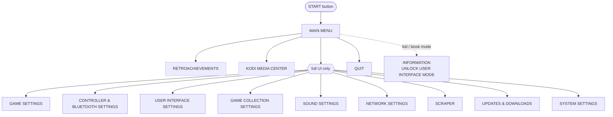
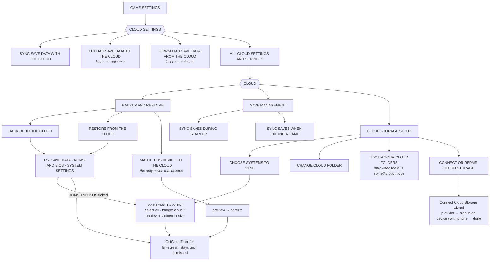

# EmulationStation menu map

Where every screen lives, so a new feature can be placed rather than invented.
Derived from `es-app/src/guis/` in `ROCKNIX/emulationstation-next` (surveyed
2026-08-19 against the `20260818` build) and verified against the running UI with
`tools/vm-visual-qa`.

Companion documents: [es-ui-style-guide.md](es-ui-style-guide.md) — how a screen
should look and behave once you know where it goes; and
[conflict-wizard-ia.md](conflict-wizard-ia.md) — the flow and screen structure
for the cloud-save conflict wizard (#23), now entering implementation — milestone "Cloud Saves: Visual Conflict Resolution".

## Two ways in

EmulationStation has **two** entry points, and they lead to different trees:

| Button | Opens | Purpose |
|---|---|---|
| **START** | MAIN MENU | Everything configurable |
| **SELECT** | QUICK ACCESS (system view) / VIEW OPTIONS (game list) | Context actions for what is on screen |

Both are built by the same code (`GuiMenu::openQuitMenu_static` serves QUIT and
QUICK ACCESS), which is why QUIT's rows appear inside QUICK ACCESS.

## Main menu

In **kid or kiosk mode the entire block above collapses** to INFORMATION,
UNLOCK USER INTERFACE MODE, RETROACHIEVEMENTS (if configured) and QUIT. Anything
you add to the full-UI block simply does not exist for those users — which is the
correct default for configuration, but check it deliberately.

## What lives where

The section headers (`addGroup`) are the real information architecture; use them
to decide where something belongs.

| Destination | Groups it contains |
|---|---|
| **GAME SETTINGS** | TOOLS · ACCOUNTS · BIOS SETTINGS · SAVESTATES · DEFAULT GLOBAL SETTINGS · **CLOUD SETTINGS** · SYSTEM SETTINGS (per-system config) |
| **CONTROLLER & BLUETOOTH** | SETTINGS · BLUETOOTH · DISPLAY OPTIONS · BEHAVIOR · PLAYER ASSIGNMENTS |
| **USER INTERFACE** | APPEARANCE · CONTROL OPTIONS · DISPLAY OPTIONS · GAMELIST OPTIONS · ICONS |
| **GAME COLLECTION** | COLLECTIONS TO DISPLAY · CREATE CUSTOM COLLECTION · OPTIONS |
| **SOUND** | VOLUME · MUSIC · SOUNDS |
| **NETWORK** | INFORMATION · SETTINGS · NETWORK SERVICES · SYNCTHING SERVICES · VPN SERVICES · FINISH RESTORE SETUP (only after a restore) — *no cloud group; D-UI-015/017* |
| **SCRAPER** | tabbed: SCRAPE · OPTIONS · ACCOUNTS |
| **UPDATES & DOWNLOADS** | DOWNLOADS · SOFTWARE UPDATES |
| **SYSTEM SETTINGS** | SYSTEM · HARDWARE · DEVICE · STORAGE · PERFORMANCE · TWEAKS · SUSPEND · LED HARDWARE · ADVANCED |

Two placement rules the existing tree already follows:

- **Read-only facts come before editable settings.** NETWORK SETTINGS opens with
  an INFORMATION group (IP address, internet status) and only then SETTINGS.
- **Destructive and system-level operations sit behind ADVANCED**, inside SYSTEM
  SETTINGS → SYSTEM MANAGEMENT AND RESET, where every row confirms first.

## Cloud (our subtree)

As built on 2026-09-04 (D-UI-015, reversed in part by D-UI-017). One door:
`GAME SETTINGS > CLOUD SETTINGS`. The three save actions sit at that level
because saves move constantly; everything occasional is one row further in.
`NETWORK SETTINGS` carries no cloud group any more — the pointer that lived
there was two doors onto one room.

Rows carry three lines — title, what it carries, `Last … - Succeeded/Failed`
— read from `/storage/.cache/cloud_sync/last-<name>` (D-UI-014 lineage).
Anything measured in minutes runs in `GuiCloudTransfer`, not a card
(`es-native-ui.md`, the fourth tier). Exit 3 from any script means another
sync held the lock and is shown as SKIPPED, not FAILED.

## Screens you cannot reach from the main menu

These are entered from the game list or the launch flow, and are easy to forget
when reasoning about "where does the user see this?":

| Screen | Entered from |
|---|---|
| VIEW OPTIONS | SELECT in a game list |
| *(game name)* game options | long-press South / North in a game list |
| SAVESTATE MANAGER | game launch, when savestates are enabled |
| metadata editor, single-game scraper | game options |
| CONNECT TO NETPLAY | system view |
| QUICK ACCESS | SELECT in the system view |
| media viewers (manual, video) | game options, quick access |

## Adding a new destination

1. **Prefer an existing group.** Nearly everything belongs under a group that
   already exists; a new top-level main-menu entry is almost never right.
2. **A new top-level entry has no themed icon.** Theme `menuIcons` names are a
   fixed vocabulary (`iconSystem`, `iconUI`, `iconNetwork`, `iconAdvanced`, …),
   so an entry outside that list renders without one until upstream adds it.
3. **Check the mode gates.** Decide explicitly whether kid/kiosk users should see
   it, and whether it needs `isFullUI`.
4. **Gate on capability, not assumption** — `Utils::FileSystem::exists("/usr/bin/tool")`
   for OS-shipped scripts, `ApiSystem::isScriptingSupported(...)` for batocera-style
   backends.

## Upstream references

There is **no upstream documentation of menu structure or UX** — `THEMES.md`
covers only how a theme repaints menus (colors, fonts, switch/slider artwork).
The closest thing to a specification is the Batocera wiki's menu tree, which
enumerates the same top-level structure this fork ships:

- <https://wiki.batocera.org/menu_tree> — menu enumeration (de-facto placement spec)
- <https://wiki.batocera.org/emulationstation_overview> — interaction conventions
  (cardinal button names, South confirms / East cancels, help-bar rule)

ES-DE and RetroPie documentation describes *different* forks and does not apply.
