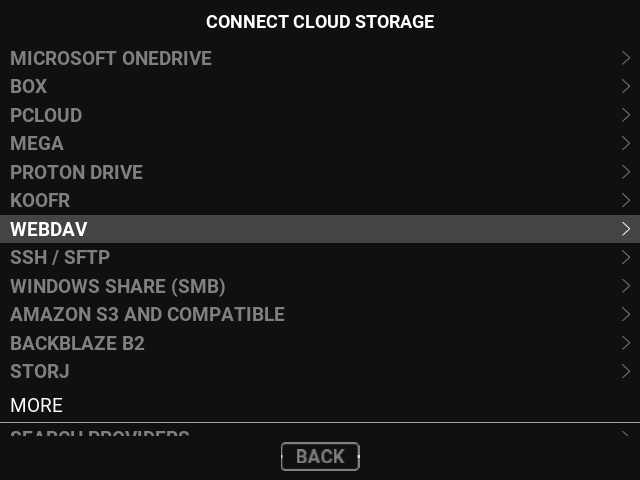
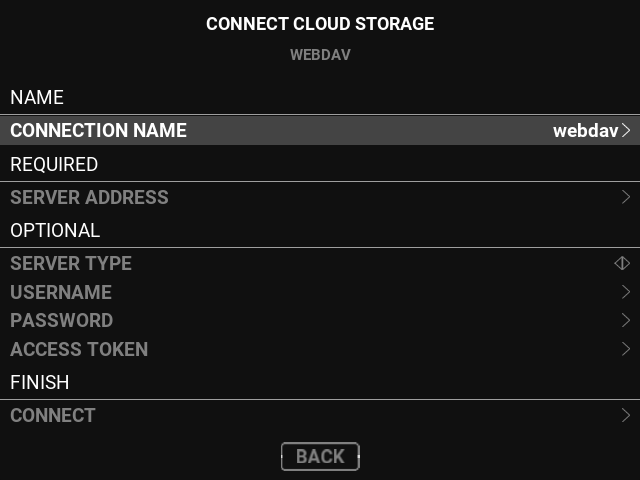
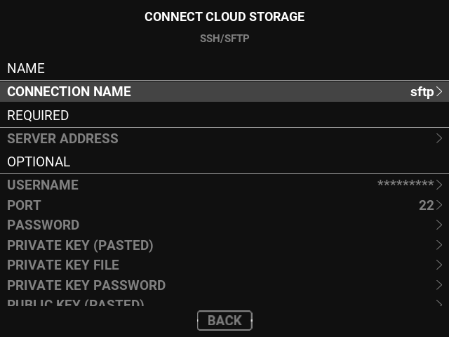
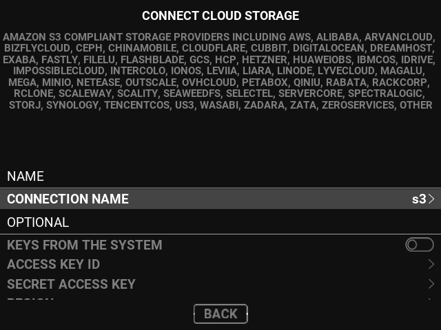
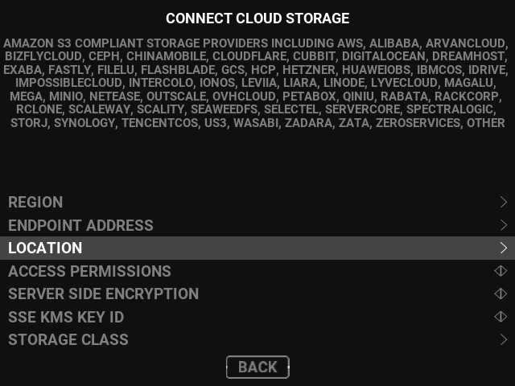
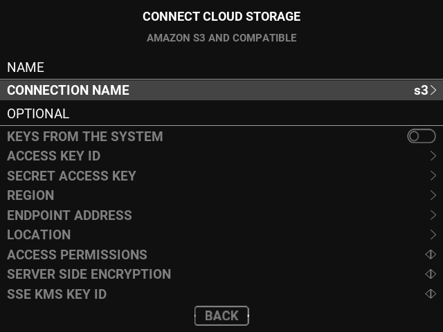
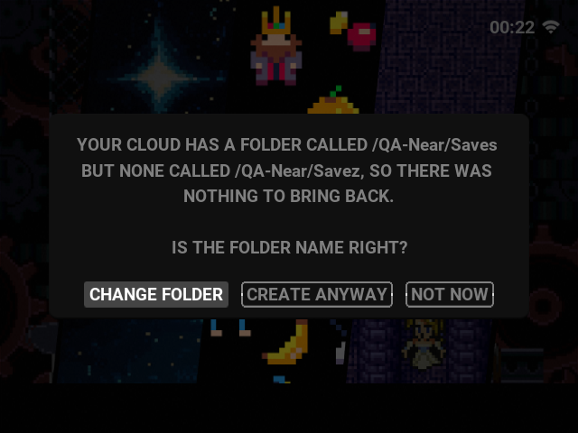
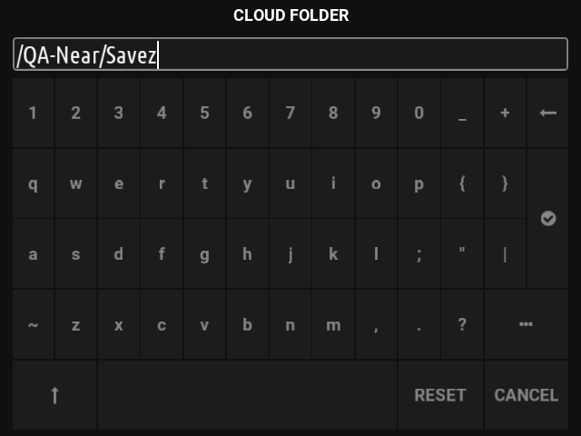

# Frames for the maintainer's two decisions (2026-09-11)

GENERIC_X64 guest at 640x480, the panel size of the RG35XX SP. Images `757ca87084`
(the first six) and `af2db4ab09` (the last). Filed for #123, #127 and #128; the
decisions are D-UI-038, D-CLOUD-091 and D-CLOUD-092 in `docs/decision-register.md`.

## How to reach the provider forms (#123)

MAIN MENU (START) → GAME SETTINGS → the CLOUD SETTINGS group → MANAGE CLOUD STORAGE
→ the CLOUD page → under CLOUD STORAGE SETUP, CONNECT OR REPAIR CLOUD STORAGE →
CONNECT CLOUD STORAGE (the provider list) → a provider → its form. On a device with
no cloud storage yet, BACK UP TO THE CLOUD or RESTORE FROM THE CLOUD asks
"NO CLOUD STORAGE IS SET UP ON THIS DEVICE YET. SET IT UP NOW?" and YES opens the
same list; the first-boot journey offers it too.

| Frame | What it shows |
| --- | --- |
|  | CONNECT CLOUD STORAGE: the recommended list, WEBDAV selected |
|  | WebDAV form: SERVER ADDRESS, SERVER TYPE, USERNAME, PASSWORD, ACCESS TOKEN (were URL, VENDOR, USER, PASS, BEARER_TOKEN) |
|  | SSH/SFTP form: SERVER ADDRESS, USERNAME, PORT, PASSWORD, PRIVATE KEY (PASTED), PRIVATE KEY FILE, PRIVATE KEY PASSWORD ... |
|  | S3 form on `757ca87084`: the new labels, and the subtitle paragraph that became #128 |
|  | S3 form scrolled: REGION, ENDPOINT ADDRESS, LOCATION, ACCESS PERMISSIONS ... |
|  | S3 form on `af2db4ab09`: subtitle AMAZON S3 AND COMPATIBLE (#128); SERVER SIDE ENCRYPTION and SSE KMS KEY ID are the unmapped fallback |

## The near-name offer (#127)

Provoked the way a player meets it: the startup sync with `/QA-Near/Savez`
configured beside a real `/QA-Near/Saves`.

| Frame | What it shows |
| --- | --- |
|  | YOUR CLOUD HAS A FOLDER CALLED /QA-Near/Saves BUT NONE CALLED /QA-Near/Savez ... IS THE FOLDER NAME RIGHT? — CHANGE FOLDER / CREATE ANYWAY / NOT NOW |
|  | CHANGE FOLDER opens the CLOUD FOLDER editor pre-filled with the configured path |
